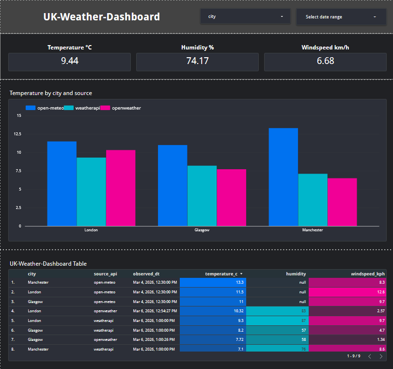
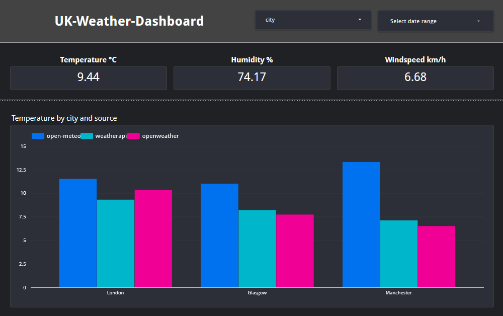
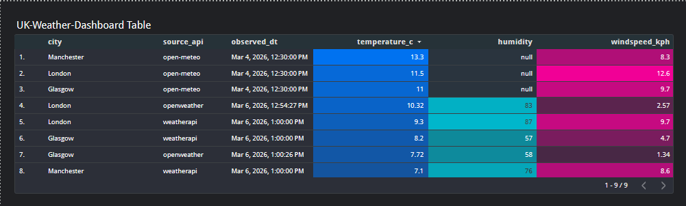

# UK Weather Data Pipeline

End-to-end data pipeline that collects weather data from multiple APIs, loads it into Google BigQuery, and visualizes the results in Looker Studio.

This project was built as a portfolio piece to practice data ingestion, ELT pipeline design, cloud data warehousing, and dashboard analytics. It demonstrates how multiple external APIs can be combined into a unified dataset for analysis and visualization.

## Features

- Extract weather data from multiple APIs
- Load data into Google BigQuery
- Compare weather readings across providers
- Unified SQL view for analytics
- Dashboard visualization in Looker Studio
- Meltano-managed ELT pipeline
- Structured project layout for analytics workflows

## Tech Stack

- Python 3
- Meltano
- Singer Taps
- Google BigQuery
- Looker Studio
- Git / GitHub

## Data Sources

The pipeline collects weather data for three UK cities:

- London
- Manchester
- Glasgow

Weather APIs used:

### Open-Meteo
- Temperature
- Wind speed
- Weather code
- Observation time

### OpenWeather
- Temperature
- Humidity
- Pressure
- Wind speed


### WeatherAPI
- Temperature
- Feels-like temperature
- Wind speed
- Visibility
- Humidity

Using multiple providers allows comparison of readings across APIs.

## How to Run

Clone the repository
```
git clone https://github.com/YOUR_USERNAME/uk-weather-dashboard.git
```

Navigate into the project
```
cd uk-weather-dashboard
```

Install dependencies
```
pip install -r requirements.txt
```

Run the Meltano pipeline
```
meltano run tap-rest-api-msdk target-bigquery
```

## Environment Variables
Create a .env file with your API keys.

Example:
```
OPENWEATHER_API_KEY=your_api_key_here
WEATHERAPI_KEY=your_api_key_here
```

## Project Structure
```
uk-weather-dashboard/
├── analyze/        # Analytical queries
├── extract/        # Data extraction logic
├── load/           # Data loading processes
├── transform/      # SQL transformations and views
├── notebook/       # Exploration notebooks
├── orchestrate/    # Pipeline orchestration configs
├── output/         # Generated outputs
│
├── meltano.yml     # Meltano pipeline configuration
├── requirements.txt
├── README.md
└── .gitignore
```

## What I Learned

- Building ELT pipelines using Meltano
- Integrating multiple third-party APIs
- Loading data into Google BigQuery
- Structuring raw vs analytics datasets
- Writing SQL transformations for unified datasets
- Designing dashboards in Looker Studio
- Managing a data project with Git and GitHub

## Possible Improvements

- Add historical weather tracking
- Schedule pipeline runs automatically
- Add data validation checks
- Extend to additional cities or APIs
- Implement automated testing for data quality

## Dashboard Preview

### Overview


### Temperature Comparison by City and API


### Raw Weather Data Table


## Author
Hanroux